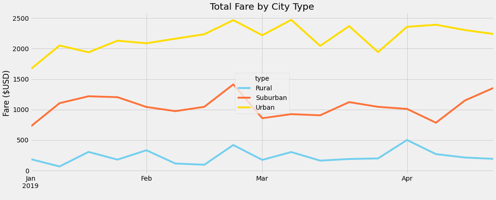
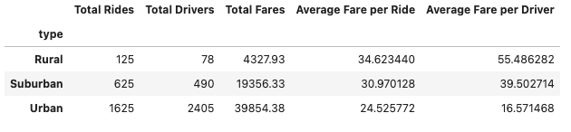

# PyBer Analysis

## Overview
The purpose of this challenge was to create a DataFrame of the ride-sharing data from the Urban, Suburban, and Rural city types. With this data and using Matplotlib to then create a multiple line graph showing the total weekly fares for each city type.

## Results
From the data you will see that the Urban cities make a little less than ten times the amount of rural cities and around double the amount from suburban cities. The multiple line graph shows that there is a steady up and down in total fares. Dipping low one week and bouncing back the following week. The only you time you see a major shift is in the suburban data between Febuary, 24 2019	through March, 3 2019. It started with having their highest total to only drop to their second lowest total between these four months. 

Using the DataFrame shows that the total rides have even more of a gap between each city type then total fares results. Urban lead with 1,625 rides meaning rural had less than ten percent comparatively. These large differences are not shown in the average fare per ride oddly enough.

## Summary
For the first recommendation would the average fare ride should be lowered in rural fare prices to try an encourage more people to use the service. It would also help to hire more drivers to offset the amount of rides per driver and allow more customers to be able to get rides. This can be seen in the data that more drives equals more money. Lastly the data should use information from the whole year rather than just a few months.
